# Twinkle

## 整体架构

### 软件系统架构:

​	Android+okhttp连接+Spring boot服务器+oracle数据库+腾讯云端

​	服务器地址：https://github.com/DNFDS/TwinkleSever

### 实体类：

​	Song

​	Songlist

​	News

​	NewsComment

​	User

​	Album

​	Singer

### 细节实现：

​	ViewPage+fragment实现顶部导航栏

​	PullToRefresh库实现下拉刷新页面

## 推荐音乐部分

### 界面展示:

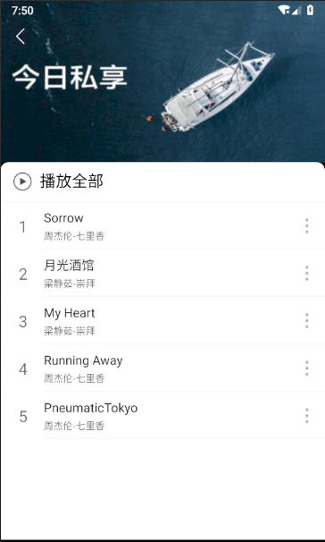

### 主要涉及类：

​	FgFindmusicFragment

​	RecommendSongActivity

### 实现功能：

​	推荐单曲、推荐歌单

## 个人音乐部分

### 界面展示

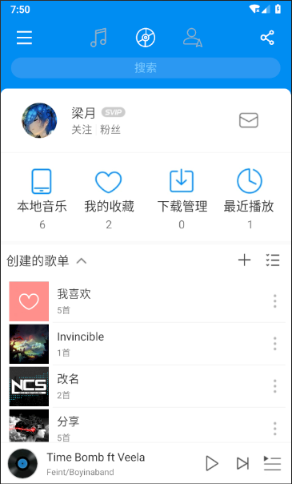

9.png)

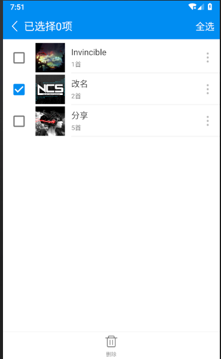

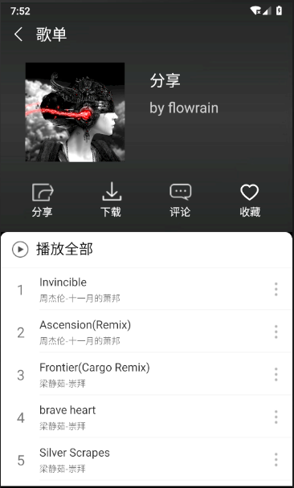

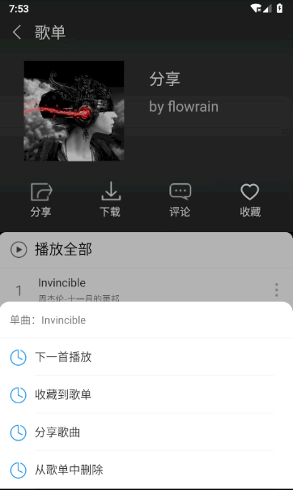

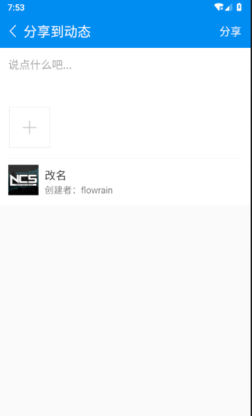

### 主要涉及类

​	FgMymusicFragment

​	Songlistadapter

​	ShareSonglistActivity

​	ShareSongActivity

​	ManageSonglistActivity

​	ManageSonglistAdapter

​	EditSonglistActivity

​	EditSonglistNameActivity

​	SonglistDetailActivity

 	SonglistDetailAdapter

​	AddSongAdapter

### 实现功能

​	查看自己的创建的和收藏歌单

​	新建歌单

​	修改歌单信息

​	删除歌单

​	从歌单中删除歌曲

​	把歌曲添加到我喜欢

​	把歌曲从我喜欢中删除

​	收藏歌单和取消收藏歌单

​	添加歌单到歌单

​	分享歌单

​	分享单曲

## 好友动态部分

### 界面展示

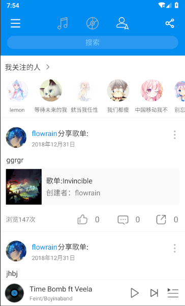

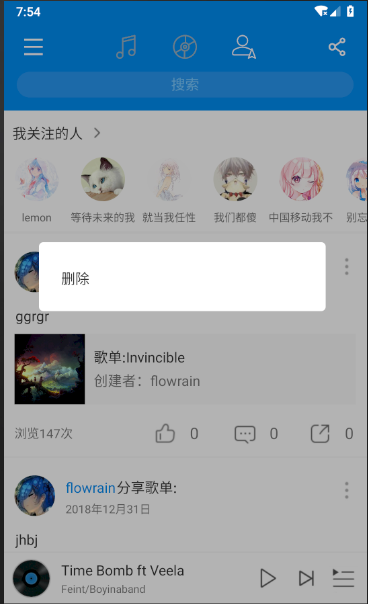

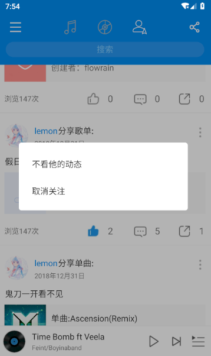

### 主要涉及类

​	FgFriendsFragment

​	NewsDetailActivity

​	NewsAdapter

​	NewsCommentAdapter

​	friendsAdapter

​	ShareNewsActivity

### 实现功能

​	查看自己和好友的动态

​	删除自己的动态

​	取关好友

​	查看自己关注的人

​	给动态点赞和取消点赞

​	转发动态

​	查看动态详情

​	查看被转发的动态的详情

​	评论动态

​	回复评论

​	给评论点赞和取消点赞

​	播放动态中的歌曲

​	查看动态中的歌单

## 搜索部分

### 界面展示

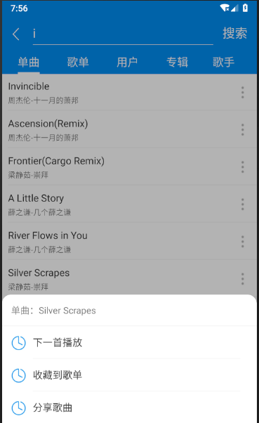

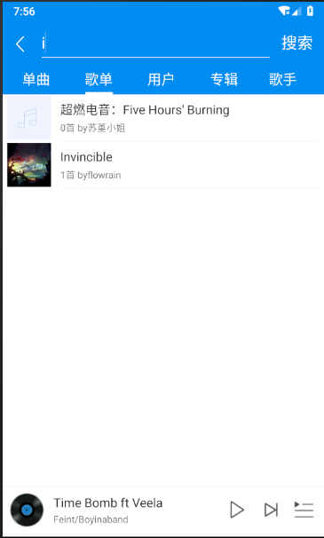

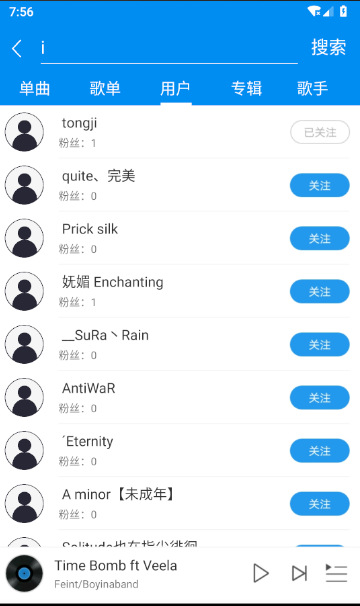

### 主要涉及类

​	FgsearchsongFragment

​	FgsearchsonglistFragment

​	FgsearchuserFragment

​	SearchMainAcitivity

​	SearchSongAdapter

​	SearchSonglistAdapter

​	SearchUserAdapter

### 实现功能

​	搜索歌曲

​	搜索歌单

​	搜索用户

​	播放歌曲

​	将歌曲加入下一首播放

​	分享歌曲

​	分析歌单

​	查看歌单

​	关注和取消关注用户

​	将歌曲加入歌单

​	播放列表部分

## 播放列表部分

### 界面展示:

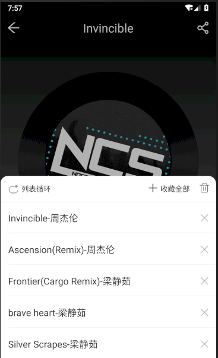

### 主要涉及类：

​	PlayingSongList

### 实现功能：

​	独立于收藏歌单、云歌单的播放列表。是直接与用户和播放器以及云歌单进行交互的唯一类。

​	用户选中歌单后，在各单详情页面选中任意单独歌曲，都会先获得播放列表的唯一实例，并调用InitPlayingSongList() 函数，讲当前所选歌单的歌曲复刻至该播放列表内部数组中（Array List<Song>）中。同时会将定位指针（PointerIndex）指向当前选中的歌曲。随后，系统调用播放器相关函数，播放当前播放列表中定位指针所指向的歌曲。

​	添加/删除播放列表中指定歌曲，支持添加到末尾或下一首。	

​	支持清空播放列表。

​	可在播放器界面显示。

## 音乐播放器部分

### 界面展示

### 实现功能

​	歌曲的播放暂停

​	歌曲的标题与封面展示

​	超长标题的滚动展示

​	歌曲封面的旋转展示

​	歌曲播放进度的实时追踪

​	歌曲播放进度的实时调整

​	自由切歌（上/下一首 或 直接点选）

​	实现播放音乐Service化，支持退出界面后继续播放

​	退出后仍然保存进度，返回播放器界面后继续播放

​	跳转至分享界面

​	添加或移除收藏

​	展示当前的播放列表

### 主要涉及类

​	PlayerActivity

​	MusicService

​	PlayingSongList

​	ImageViewCircle

​	TextViewRoll

## 在线音乐播放临时改为在线MV播放部分

- 因年末时Github上的QQ与网易云音乐API等失效，临时将在线音乐部分播放改为在线模拟MV播放；
- 使用 http://api.m.mtime.cn/PageSubArea/TrailerList.api 所提供的网络视频的API，模拟了获取音乐MV的过程；
- 属于临时试验性的另外单独开发的内聚模块，为弥补一下在线音乐缺失的遗憾，单独使用了xUtils3框架的部分进行开发，想要最后与项目主线部分进行低限度耦合；
- 可独立运行（该模块基于项目中期基础上开发），但最终的耦合会出现莫名的获取不了API返回数据的问题，抛出异常显示联网获取数据失败，但仍未知具体原因；因此决定还是单独打包上传一份可独立运行该模块功能的软件；
- 起初该模块也与在线视频播放一起实现了本地音乐的读取与播放，但该部分较为简陋，仍以主项目的音乐播放功能为主。

## 第三方库与框架

- Glide
- Picasso
- Gson
- xUtils3
- Vitamio

## 功能和使用说明

- 点击首页推荐中的”MV推荐“进入视频列表

​						支持列表下拉刷新获取数据、上拉列表加载更多数据

- 点击任意Item进入视频播放页面

​	在页面中点击屏幕弹出操作菜单，可以进行播放-暂停、音量调节、返回、上/下一个视频和全屏的功能

## 类与代码说明

- 详见代码注释

​	

